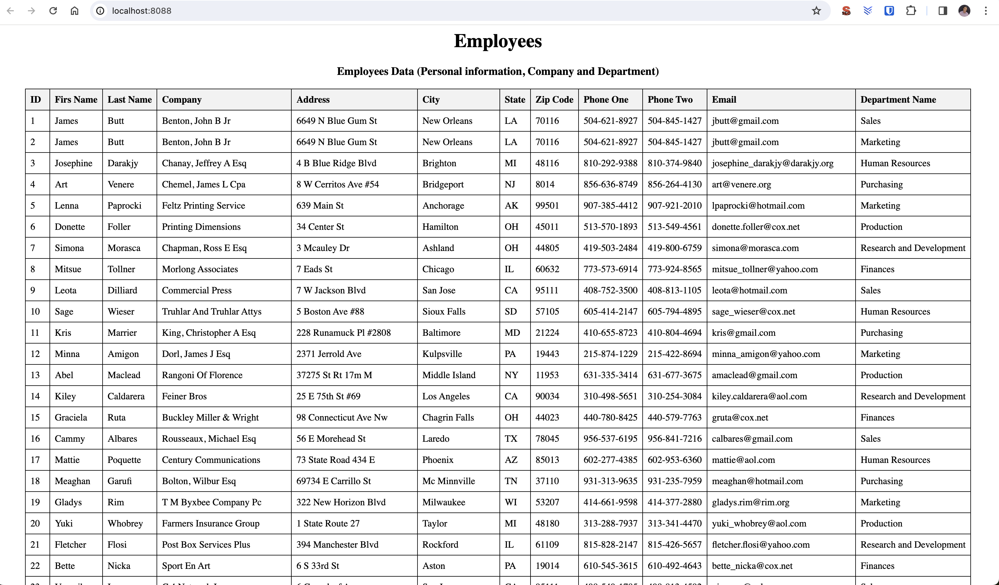

# Tecnical Challenge for Data Engineer - XalDigital

## Description
The project consists to design the database based on employees file, ingest the files attached into the postgres database and build a REST API to get the records from the database.

## Sample of data
| first_name | last_name | company_name | address | city | state | zip | phone1 | phone2 | email | department |
|--------|------|------|--------|------|------|--------|------|------|--------|------|
| James | Butt | Benton, John B Jr | 6649 N Blue Gum St | New Orleans | LA | 70116 | 504-621-8927 | 504-845-1427 | jbutt@gmail.com | Sales |
| James | Butt | Benton, John B Jr | 6649 N Blue Gum St | New Orleans | LA | 70116 | 504-621-8927 | 504-845-1427 | jbutt@gmail.com | Marketing |
| Josephine | Darakjy | Chanay, Jeffrey A Esq | 4 B Blue Ridge Blvd | Brighton | MI | 48116 | 810-292-9388 | 810-374-9840 | josephine_darakjy@darakjy.org | Human Resources
| Art | Venere | Chemel, James L Cpa | 8 W Cerritos Ave #54 | Bridgeport | NJ | 8014 | 856-636-8749 | 856-264-4130 | art@venere.org | Purchasing |

## Functionality for this challenge

1. Design the E-R from the database and create the structure based on the files attached. 
2. Ingest the data from the centos server to the postgres database. 
3. At least the ‘read’ request must be supported for the API. 
4. The server where the API is going to be deployed must have access only to the postgres database. And the centos server must have access only to the postgres database as well.

## Development
1. E-R Model: The model was generated from the csv file where split the data into 3 dimension tables (dim_person, dim_company, dim_department) and 1 fact table (fact_employees)  
  

2. Ingest the data from the centos: I developed an app for ingest data from CSV file to postgresql.  

#### The logic:
- Read from CSV file the information about person, company and department
- Transformation and validation of information about state values
- Validation in the database - that the data to be loaded is not found in the tables
- Upload the data into tables

#### The APP path:  
- app/
  - data/
    - sample_data.csv
  - utils/
    - file_manager.py
    - postgres_db.py
  - dim_company_load.py
  - dim_department_load.py
  - dim_person_load.py
  - fact_employees_load.py

This application will be located in the CentOS container and will run to load the data into the PostgreSQL database when the container is executed.

3. Reading database with API: I develop an python api with Flask for read employees information  
#### The logic:
- Create a Flask app.
- Read from database with a query information about employees from fact_employees table.
- Make available the data from the url 127.0.0.1:8088

#### The APP path:  
- api/
  - get_employees.py

### The result
  

4. The server API and CentOS server must have access only to the postgres database as well. 

#### Docker
The provided docker-compose file was modified to meet the project requirements.  
The centos container was modified with command and environment segments:
```yaml
  centos:
    image: centos:latest
    command: /bin/bash -c "sed -i -e 's|mirrorlist=|#mirrorlist=|g' /etc/yum.repos.d/CentOS-* && sed -i -e 's|#baseurl=http://mirror.centos.org|baseurl=http://vault.centos.org|g' /etc/yum.repos.d/CentOS-* && yum update -y && yum install -y python3 && yum clean all && pip3 install --upgrade pip && pip install pandas && pip install psycopg2-binary && cd app/ && python3 dim_company_load.py && python3 dim_person_load.py && python3 dim_department_load.py && python3 fact_employees_load.py"
    environment:
      - HOST_DB=db
      - PORT_DB=5432
      - DB_NAME=postgres
      - DB_USER=postgres
      - DB_PASSWORD=example
    volumes:
      - ./app/:/app/
    networks:
      - postgres
```

The Python container was added to host the consumption API there:
```yaml
  python_app:
    image: python:3.10.0
    command: /bin/bash -c "pip install flask && pip install psycopg2-binary && cd api/ && flask --app get_employees run --host=0.0.0.0"
    volumes:
      - ./api/:/api/
    environment:
      - FLASK_APP=get_employees.py
      - HOST_DB=db
      - PORT_DB=5432
      - DB_NAME=postgres
      - DB_USER=postgres
      - DB_PASSWORD=example
    ports:
      - 8088:5000
    networks:
      - postgres
```

#### SQL  
A SQL folder was added containing an initialization script which generates the tables of the model to store employee data.
- init.sql
#### Requeriments
The requeriments file contains the python libraries necesaries to execute the app ingest and api request (note: the containers will install them automatically)
- requeriments.txt
